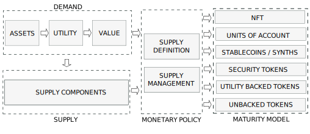

:::danger
`(Under development. Please, come back later. Just published to share the progress)`
:::

## Introduction

<table>
  <tr>
    <td></td>
    <td></td>
    <td></td>
    <td></td>
    <td></td>
    <td></td>
    <td></td>
    <td></td>
  </tr>
  <tr>
    <td></td>
    <td>Barter</td>
    <td>Commodity</td>
    <td>Metal</td>
    <td>Backed</td>
    <td>Fiat</td>
    <td>Plastic</td>
    <td>Crypto</td>
  </tr>
  <tr>
    <td>Scarce</td>
    <td>-</td>
    <td>-</td>
    <td>-</td>
    <td>-</td>
    <td>-</td>
    <td>-</td>
    <td>-</td>
  </tr>
  <tr>
    <td>Uniform</td>
    <td>-</td>
    <td>-</td>
    <td>-</td>
    <td>-</td>
    <td>-</td>
    <td>-</td>
    <td>-</td>
  </tr>
  <tr>
    <td>Durable</td>
    <td>-</td>
    <td>-</td>
    <td>-</td>
    <td>-</td>
    <td>-</td>
    <td>-</td>
    <td>-</td>
  </tr>
  <tr>
    <td>Portable</td>
    <td>-</td>
    <td>-</td>
    <td>-</td>
    <td>-</td>
    <td>-</td>
    <td>-</td>
    <td>-</td>
  </tr>
  <tr>
    <td>Divisibible</td>
    <td>-</td>
    <td>-</td>
    <td>-</td>
    <td>-</td>
    <td>-</td>
    <td>-</td>
    <td>-</td>
  </tr>
  <tr>
    <td>Acceptable</td>
    <td>-</td>
    <td>-</td>
    <td>-</td>
    <td>-</td>
    <td>-</td>
    <td>-</td>
    <td>-</td>
  </tr>
  <tr>
    <td>Recognised</td>
    <td>-</td>
    <td>-</td>
    <td>-</td>
    <td>-</td>
    <td>-</td>
    <td>-</td>
    <td>-</td>
  </tr>
  <tr>
    <td></td>
    <td colspan='4'>Price Formation Machine</td>
    <td colspan='2'>Abandoned Road</td>
    <td>-</td>
  </tr>
</table>

<!-- truncate -->

## The price formation machine

### Negative Feedback System

A society with a good as money creates a Negative feedback System. This can be applied to Barter, Commodity Money and Metal Money. A society with a money which value can be traced back ("regressed") to its value as a commodity also creates a Negative feedback System. This can be applied to Representative Money.

A Negative feedback occurs when some function of the output of a system is fed back in a manner that tends to reduce the fluctuations in the output, whether caused by changes in the input or by other disturbances..

|    |   | 
|-------------------------------------------------------|-----------------------------------------------------------------------|

A Negative feedback tends to reduce the effects of gain change but, in exchange, increases stability. A negative feedback system is a self regulation mechanism that helps maintain stability or balance in a system.

Characteristics
- Price formation follows marginal wishes of consumers
- Relative prices prioritize consumers wishes
- Resources are allocated according to consumers wishes.
- Entrepreneurs get fair signals about market demand
- Entrepreneurs assume the risk of their projects
- Companies are funded only by sales, according to consumers aggregated demand.
- Little entry barriers for new providers.
- New demand is always satisfied by providers.
- Values are freely chosen by citizens.

Problems
- Hoarding
- Externalities
- Critical Resources
- Money Scarcity
- The Problem of Credit

## The abandoned road

Monetary Expansion
Central Planning

Scientifically planned society. Debate on neutrality of money, Normative vs positive economics

|    |   | 
|-------------------------------------------------------|-----------------------------------------------------------------------|

You can explore a more extended list of changes on this web.

### Positive Feedback System

A society driven by monetary expansion is an example of Positive Feedback System

In a positive feedback mechanism, the output of the system stimulates the system in such a way as to further increase the output. As a consequence it amplifies or magnifies a certain disturbance or activity, leading to an increase in magnitude. Positive feedback mechanisms control self-perpetuating events that can be out of control. This tends to move a system away from its equilibrium state and make it more unstable.

|    |   | 
|-------------------------------------------------------|-----------------------------------------------------------------------|

Characteristics
- Price Formation is distorted.
- Distortion in relative prices
- Misallocation of resources.
- Entrepreneurs get distorted signals about market demand. Impossibility of Economic Calculation
- Companies are funded by credit.
- High entry barriers for new providers.
- Projects risks is transferred to citizens
- Mismatches between supply and demand. Cantillon effects
- Values imposed by credit preferences.

## Where we are?

## Privately Issued Currencies

### Currency as a driver

A Society with Privately Issued Currencies is a return to the Negative Feedback System but solves the problem of this structure

- Hoarding won't cut liquidity
- Externalities can be fixed
- There are not Critical Resources
- No Money Scarcity
- Availability of Credit

### Best of both worlds

Debt without Cantillon

- Daily poll on resource assignment. Investors and consumers, as cryptousers, decide on every action to whom assign productive resources based on their perception on the credibility of the issuer.
- Competence of money. Dislike centralized money issuing, when the money is issued by private parties in competence their relative value is proportional to the credibility of the issuer. This triggers the necessity for the issuer to boost credibility.
- Correct price formation. Investors translate to the coins the relative value that the perceive from the issuer. Consumers translate to the articles the relative value that they perceive in goods and services. Therefore, there is a correct price formation according to will of citizens.
- Relative prices prioritize consumers wishes
- Resources are allocated according to consumers wishes.
- Entrepreneurs get fair signals about market demand
- Private Investor assume the risk of their projects
- Companies are funded only by credit of investors.
- Little entry barriers for new providers.
- New demand is always satisfied by providers.
- Correct match demand/supply. Having the correct price formation for goods and services according to the will of citizens guarantees their supply matches exactly their expected demand without overpricing or undervalued mismatches of centralized money issuing. Let me social machine work on its own without bias.
- Values are freely chosen by citizens.

Not a new idea
What if the government let anyone use a currency of his or her choosing? What if the government permitted entrepreneurs to innovate in the monetary sector, such as by creating digital currencies or minting commodity money? This is precisely what F.A. Hayek argues in his book.

## Crypto

### Tokenization

