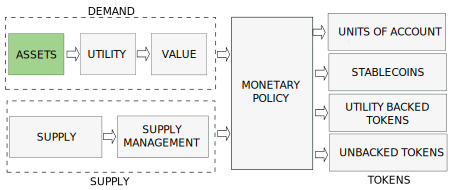

import JSONTable from '@site/src/components/ui/JSONTable';
import data from "/static/data/underlying.json"

---

:::danger
`(Under development. Please, come back later. Just published to share the progress)`
:::

# Underlying Assets

## Introduction

A cryptocurrency is made of 4 elements:
- the demand, including **the underlying asset**, the provided utilities and the value
- the supply and supply management
- the monetary policy which combines demand and supply
- the token types generated by the monetary policy

We will discuss the Underlying Assets in this post and leave the other aspects for next posts.

<!-- truncate -->

## Tokenizable Assets

<JSONTable theadData={Object.keys(data[0])} tbodyData={data}/>