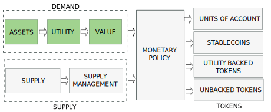

---

import JSONTable from '@site/src/components/ui/JSONTable';
import underlying from "/static/data/underlying.json"
import economic_value from "/static/data/economic_value.json"
import utility from "/static/data/utility.json"

:::danger
`(Under development. Please, come back later. Just published to share the progress)`
:::

# Introduction

The nature, behaviour and price of a cryptocurrency is determined by the interaction between a demand and a supply coordinated by a monetary policy. Depending on the policy we will have different types of tokens.

In this post we will examine the demand and leave supply and monetary policy for other posts.

<!-- truncate -->

# Tokenizable Assets

<JSONTable theadData={Object.keys(underlying[0])} tbodyData={underlying}/>

# Token Ecosystem

# Token Utility

<JSONTable theadData={Object.keys(utility[0])} tbodyData={utility}/>

# Token Intrinsic Value

Intrinsic value is the value that the token gains from the credibility and utility of its project.

Economic value differs according to the different Schools of Economic Thought. This is relevant because, when we design a token, we can adhere to the Economic School of our choice. Below there is simplified list of economic values:

<JSONTable theadData={Object.keys(economic_value[0])} tbodyData={economic_value}/>

All these theories of economic value can be classified in 2: objective and subjective value theories. The objective, or intrinsic, theories of value hold that the value of an object, or a good, or service, is intrinsic, meaning that it can be estimated using objective measures. Most such theories look to the process of producing an item, and the costs involved in that process, as a measure of the item's intrinsic value. The subjective theory of value, instead, states that prices of goods and services in a market are determined by the subjective preferences of consumers.

According to the nature of the value and the way that the value is captured, we have different types of cryptocurrencies:

Once the value is captured, we need to provide additional utilities to the token to retain and, maybe, grow, this value to maintain velocity of circulation under controlled margins.

# Token Speculative Value

Speculative value is the value that the token gains from speculations traders make on a token's price.