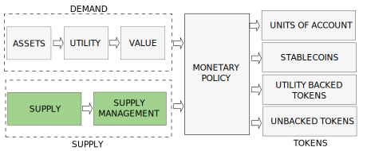

:::danger
`(Under development. Please, come back later. Just published to share the progress)`
:::

# Supply Management

## Introduction

A cryptocurrency is made of 4 elements:
- the demand, including the underlying asset, the provided utilities and the value 
- **the supply and supply management**
- the monetary policy which combines demand and supply
- the token types generated by the monetary policy

We will discuss the Supply and Supply Management in this post and leave the other aspects for next posts.

<!-- truncate -->

## Token Ecosystem

## Token Utility

## Token Intrinsic Value

## Token Speculative Value

