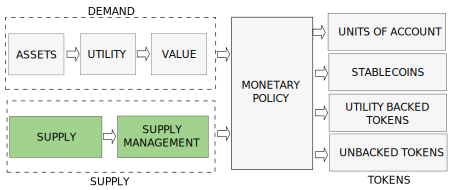

:::danger
`(Under development. Please, come back later. Just published to share the progress)`
:::

# Introduction

The nature, behaviour and price of a cryptocurrency is determined by the interaction between a demand and a supply coordinated by a monetary policy. Depending on the policy we will have different types of tokens.

We will discuss the Supply and Supply Management in this post and leave demand and Monetary Policy for next posts.

<!-- truncate -->

# Supply Components

# Supply Management

Reserve

# Supply Management Policies

- ## Burn and Mint Equilibrium

- ## Stability Fees

- ## Elastic Supply Tokens (Rebases)

