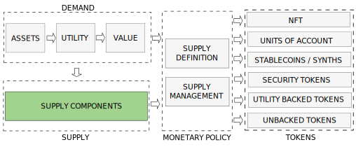
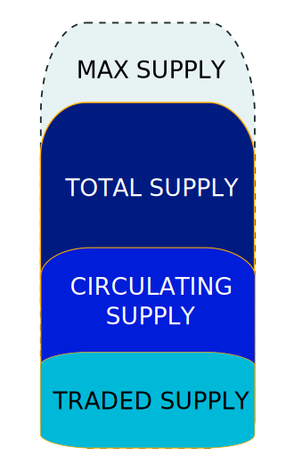

---

:::danger
`(Under development. Please, come back later. Just published to share the progress)`
:::

## 1. Introduction
---

The nature, behaviour and price of a cryptocurrency is determined by the interaction between a demand and a supply coordinated by a monetary policy. Depending on the policy we will have different types of tokens.

We will discuss the Supply and Supply Management in this post and leave demand and Monetary Policy for next posts.

<!-- truncate -->

## 2. Definitions of Supply
---

### 2.1 Supply

### 2.2 Balances

## 3. Supply Operations
---

### 3.1 Mint

### 3.2 Burn

### 3.3 Transfer

### 3.4 Swap

## 4. Supply Components
---

### 4.1 Total Supply

### 4.2 Max Supply

### 4.3. Locked Supply

### 4.4. Circulating Supply

### 4.5. Tradeable Supply

## 5. Token Initial Allocations
---

