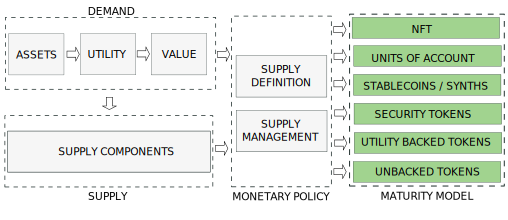

---

import JSONTable from '@site/src/components/ui/JSONTable';
import tokens_utility from "/static/data/tokens_utility.json"

:::danger
`(Under development. Please, come back later. Just published to share the progress)`
:::

## 1. Introduction
---

The nature, behaviour and price of a cryptocurrency is determined by the interaction between a demand and a supply coordinated by a monetary policy. Depending on the policy we will have different types of tokens.

We will discuss the Maturity Model in this post and leave demand and supply for next posts.

<!-- truncate -->

## 2. A Tokenization Maturity Model
---

A Tokenization Maturity Model could be established as a ranking of the purity in capturing the properties of the underlying asset. This model would not evaluate the value of the asset, or its utilities within the token model, but the ability of the capture process. The main criteria for this maturity model would be:

- Decentralization in the network consensus. Existing great work by a16z for protocols decentralization should be referenced here
- Decentralization in the smart contract
- Independence from other currencies

In that way, 2 tokenization protocols capturing gold as underlying asset, could be at different level of maturity depending on the goods of the designed protocol.

The picture below represents a initial structure of the maturity model. It only considers the goal of the capture process. Sub-levels could be established to accommodate different degrees of issuer intervention.

Commodity Money would be at the highest level of the maturity Model as its value matches the value of the underlying asset. However, attention should be paid on the decentralization guaranteed by the processes of the issuer.

### 2.1. Tokenization Map

<table class="table w-auto mx-auto fs-6">
	<thead class="thead-dark">
		<tr>
			<th scope="col"></th>
			<th scope="col"></th>
			<th scope="col" colspan="6">Maturity Model</th>
		</tr>
		<tr>
			<th scope="col">Type</th>
			<th scope="col">Assets</th>
			<th scope="col">Unbacked</th>
			<th scope="col">Utility</th>
			<th scope="col">Yield</th>
			<th scope="col">Price</th>
			<th scope="col">Value</th>
			<th scope="col">Asset</th>
		</tr>
	</thead>
	<tbody>
		<tr>
			<td rowspan="6">Physical Assets	</td>
			<td>Commodity</td>
			<td></td>
			<td></td>
			<td></td>
			<td></td>
			<td>X</td>
			<td></td>
		</tr>
		<tr>
			<td>Real Estate</td>
			<td></td>
			<td></td>
			<td></td>
			<td></td>
			<td></td>
			<td></td>
		</tr>
		<tr>
			<td>Art</td>
			<td></td>
			<td></td>
			<td></td>
			<td></td>
			<td></td>
			<td></td>
		</tr>
		<tr>
			<td>Art</td>
			<td></td>
			<td></td>
			<td></td>
			<td></td>
			<td></td>
			<td></td>
		</tr>
		<tr>
			<td>Industrial Assets</td>
			<td></td>
			<td></td>
			<td></td>
			<td></td>
			<td></td>
			<td></td>
		</tr>
		<tr>
			<td>Collectibles</td>
			<td></td>
			<td></td>
			<td></td>
			<td></td>
			<td></td>
			<td></td>
		</tr>
		<tr>
			<td rowspan="5">Digital Assets</td>
			<td>Digital Art</td>
			<td></td>
			<td></td>
			<td></td>
			<td></td>
			<td></td>
			<td></td>
		</tr>
		<tr>
			<td>Digital Collectibles</td>
			<td></td>
			<td></td>
			<td></td>
			<td></td>
			<td></td>
			<td></td>
		</tr>
		<tr>
			<td>Music</td>
			<td></td>
			<td></td>
			<td></td>
			<td></td>
			<td></td>
			<td></td>
		</tr>
		<tr>
			<td>Gaming</td>
			<td></td>
			<td></td>
			<td></td>
			<td></td>
			<td></td>
			<td></td>
		</tr>
		<tr>
			<td>Corporate Branding</td>
			<td></td>
			<td></td>
			<td></td>
			<td></td>
			<td></td>
			<td></td>
		</tr>
		<tr>
			<td rowspan="5">Financial Assets</td>
			<td>Currencies</td>
			<td></td>
			<td></td>
			<td></td>
			<td></td>
			<td></td>
			<td></td>
		</tr>
		<tr>
			<td>Bonds</td>
			<td></td>
			<td></td>
			<td></td>
			<td></td>
			<td></td>
			<td></td>
		</tr>
		<tr>
			<td>Equities</td>
			<td></td>
			<td></td>
			<td></td>
			<td></td>
			<td></td>
			<td></td>
		</tr>
		<tr>
			<td>Investment Funds</td>
			<td></td>
			<td></td>
			<td></td>
			<td></td>
			<td></td>
			<td></td>
		</tr>
		<tr>
			<td>Loans</td>
			<td></td>
			<td></td>
			<td></td>
			<td></td>
			<td></td>
			<td></td>
		</tr>
		<tr>
			<td rowspan="8">Certifications</td>
			<td>Entry Tickets</td>
			<td></td>
			<td></td>
			<td></td>
			<td></td>
			<td></td>
			<td></td>
		</tr>
		<tr>
			<td>Proof of Participation</td>
			<td></td>
			<td></td>
			<td></td>
			<td></td>
			<td></td>
			<td></td>
		</tr>
		<tr>
			<td>Diplomas and Certificates</td>
			<td></td>
			<td></td>
			<td></td>
			<td></td>
			<td></td>
			<td></td>
		</tr>
		<tr>
			<td>Web Domains</td>
			<td></td>
			<td></td>
			<td></td>
			<td></td>
			<td></td>
			<td></td>
		</tr>
		<tr>
			<td>Proof of Maintenance</td>
			<td></td>
			<td></td>
			<td></td>
			<td></td>
			<td></td>
			<td></td>
		</tr>
		<tr>
			<td>Vouchers</td>
			<td></td>
			<td></td>
			<td></td>
			<td></td>
			<td></td>
			<td></td>
		</tr>
		<tr>
			<td>Loyalty Points</td>
			<td></td>
			<td></td>
			<td></td>
			<td></td>
			<td></td>
			<td></td>
		</tr>
		<tr>
			<td>Awards</td>
			<td></td>
			<td></td>
			<td></td>
			<td></td>
			<td></td>
			<td></td>
		</tr>
	</tbody>
</table>

## 3. Unbacked Tokens (No Capture)
---

No value to capture

<table class="table w-auto mx-auto fs-6">
	<thead class="thead-dark">
		<tr>
			<th scope="col">Token Backing</th>
			<th scope="col">Token Backing Type</th>
			<th scope="col">Examples</th>
		</tr>
	</thead>
	<tbody>
		<tr>
			<td scope="row" rowspan="3">Speculative Value</td>
			<td>Memecoins</td>
			<td>
				<a href="https://www.shibatoken.com/" target="_blank">SHIBA INU</a>, 
				<a href="https://safemoon.com/" target="_blank">SAFEMOON</a>
			</td>
		</tr>
		<tr>
			<td>Governance</td>
			<td>
			</td>
		</tr>
	</tbody>
</table>

## 4. Utility Tokens (Utility Capture)
---

Utility backed tokens are backed by some utility or service, but they do not follow a monetary policy to capture the underlying value or price of this service.

<table class="table w-auto mx-auto fs-6">
	<thead class="thead-dark">
		<tr>
			<th scope="col">Token Backing</th>
			<th scope="col">Token Backing Type</th>
			<th scope="col">Examples</th>
		</tr>
	</thead>
	<tbody>
		<tr>
			<td scope="row">Speculative Value</td>
			<td>Algorithmic</td>
			<td>
				<a href="https://reflexer.finance/" target="_blank">RAI</a>, 
				<a href="https://www.ampleforth.org/" target="_blank">Ampleforth</a>, 
				<a href="https://www.olympusdao.finance/" target="_blank">Olympus DAO</a>
			</td>
		</tr>
		<tr>
			<td rowspan="5">Objective Utility Token</td>
			<td>Play To Earn</td>
			<td>
				<a href="https://robotera.io/" target="_blank">RobotEra</a>, 
				<a href="https://tamadoge.io/" target="_blank">TamaDoge</a>,
				<a href="https://swordsofblood.com/" target="_blank">Swords of Blood</a>,  
				<a href="https://securedverse.io/" target="_blank">Securedverse</a>,
				<a href="https://battleinfinity.io/" target="_blank">Battle Infinity</a>,
				<a href="https://decentraland.org/" target="_blank">MANA</a>
			</td>
		</tr>
		<tr>
			<td>Move To Earn</td>
			<td>
				<a href="https://stepn.com/" target="_blank">StepN</a>
			</td>
		</tr>
		<tr>
			<td>Recycle To Earn</td>
			<td>
				<a href="https://www.ecoterra.io/en" target="_blank">Ecoterra</a>
			</td>
		</tr>
		<tr>
			<td>PoPW Network</td>
			<td>
				<a href="https://www.helium.com/" target="_blank">Helium</a>, 
				<a href="https://www.pollenmobile.io/" target="_blank">Pollen Mobile</a>, 
				<a href="https://dimo.zone/" target="_blank">Dimo</a>, 
				<a href="https://hivemapper.com/" target="_blank">HiveMapper</a>,  
				<a href="https://www.planetwatch.io/" target="_blank">PlanetWatch</a>, 
				<a href="https://filecoin.io/" target="_blank">Filecoin</a>, 
				<a href="https://www.arweave.org/" target="_blank">Arweave</a>	      	
			</td>
		</tr>
		<tr>
			<td>Social Network</td>
			<td>
				<a href="https://basicattentiontoken.org/" target="_blank">BAT</a>
			</td>
		</tr>
		<tr>
			<td rowspan="2">Subjective Virtual Utility Tokens</td>
			<td>Play To Own</td>
			<td>
				<a href="https://www.luckyblock.com/en" target="_blank">Lucky Block</a>
			</td>
		</tr>
		<tr>
			<td>TCR</td>
			<td>
				<a href="https://www.reddit.com/coins/mobile" target="_blank">Reddit</a>
			</td>
		</tr>
		<tr>
			<td rowspan="3">Subjective Real Utility Tokens</td>
			<td>Exchange</td>
			<td>
				<a href="https://uniswap.org/" target="_blank">UNI</a>, 
				<a href="https://pancakeswap.finance/" target="_blank">CAKE</a>
			</td>
		</tr>
		<tr>
			<td>Supply Chain</td>
			<td>
				<a href="https://www.vechain.org/" target="_blank">VET</a>, 
				<a href="https://ambrosus.io/" target="_blank">Ambrosus</a>, 
				<a href="https://agroglobal.network/" target="_blank">Agro Global</a>,
				<a href="https://modultrade.io/" target="_blank">Modultrade</a>,
				<a href="https://gcwine.io/en/" target="_blank">GCWine</a>
			</td>
		</tr>
		<tr>
			<td>Lending</td>
			<td></td>
		</tr>
		<tr>
			<td rowspan="2">Utility Coin</td>
			<td>PoW Network</td>
			<td>
				<a href="https://bitcoin.org/en/" target="_blank">BTC</a>, 
				<a href="https://litecoin.org/" target="_blank">LTC</a>, 
				<a href="https://dogecoin.com/" target="_blank">DOGE</a>, 
				<a href="https://www.getmonero.org/" target="_blank">XMR</a>, 
				<a href="https://ethereumclassic.org/" target="_blank">ETC</a>,
				<a href="https://bitcoincash.org/" target="_blank">BCH</a>, 
				<a href="https://z.cash/" target="_blank">ZEC</a>,  
				CFX,
				<a href="https://ravencoin.org/" target="_blank">RVN</a>,
				<a href="https://ethereumpow.org/" target="_blank">ETHW</a>,
				<a href="https://runonflux.io/" target="_blank">FLUX</a>,
				<a href="https://www.horizen.io/" target="_blank">ZEN</a>
			</td>
		</tr>
		<tr>
			<td>PoS Network</td>
			<td>
				<a href="https://ethereum.org/en/" target="_blank">ETH</a>,
				<a href="https://www.binance.com/en/bnb" target="_blank">BNB</a>, 
				<a href="https://polygon.technology/" target="_blank">MATIC</a>,  
				<a href="https://solana.com/" target="_blank">SOL</a>,
				<a href="https://cardano.org/" target="_blank">ADA</a>
			</td>
		</tr>
	</tbody>
</table>

## 5. Security Tokens (Yield Capture)
---

Security tokens are digital assets that represent ownership or other rights to transfer value from an asset or asset class to a token. A security token is essentially a digital form of traditional securities. Tokenised securities, better known as security tokens, are regulated and compliant investment assets in the form of a cryptocurrency token.

<table class="table w-auto mx-auto fs-6">
	<thead class="thead-dark">
		<tr>
			<th scope="col">Type</th>
			<th scope="col">Underlaying Asset</th>
			<th scope="col">Tokens</th>
			<th scope="col">Marketplaces</th>
		</tr>
	</thead>
	<tbody>
		<tr>
			<td>Real Assets Securities</td>
			<td>Real State / REITS</td>
			<td></td>
			<td>
				<a href="https://landshare.io/" target="_blank">Landshare</a>
			</td>
		</tr>
		<tr>
			<td>Equity Securities</td>
			<td>Shares / Stocks</td>
			<td></td>
			<td>
				<a href="https://stomarket.com/" target="_blank">Stomarket</a>,
				<a href="https://www.brickken.com/" target="_blank">Brickken</a>,
				<a href="https://inqubeta.ai/" target="_blank">InQubeta</a>,
				<a href="https://securitize.io/" target="_blank">Securitize</a>
			</td>
		</tr>
		<tr>
			<td rowspan="6">Debt Securities</td>
			<td>Bonds</td>
			<td></td>
			<td>
				<a href="https://www.obligate.com/" target="_blank">Obligate</a>
			</td>
		</tr>
		<tr>
			<td>Inflation Indep Index</td>
			<td>Crypto</td>
			<td>
				<a href="https://nuon.fi/" target="_blank">Nuon</a>
			</td>
		</tr>
		<tr>
			<td>US Treasuries</td>
			<td>US Treasuries</td>
			<td>
				<a href="https://ondo.finance/ousg" target="_blank">OUSG</a>
			</td>
		</tr>
		<tr>
			<td>US Treasuries Collateralized Notes</td>
			<td>US Treasuries Collateralized Notes</td>
			<td>
				<a href="https://ondo.finance/usdy" target="_blank">USDY</a>
			</td>
		</tr>
		<tr>
			<td>Short-term Bonds</td>
			<td>Short-term Bonds</td>
			<td>
				<a href="https://ondo.finance/ostb" target="_blank">OSTB</a>
			</td>
		</tr>
		<tr>
			<td>HY Corporate Bonds</td>
			<td>HY Corporate Bonds</td>
			<td>
				<a href="https://ondo.finance/ohyg" target="_blank">OHYG</a>
			</td>
		</tr>
		<tr>
			<td>Derivative Securities</td>
			<td>Options</td>
			<td></td>
			<td></td>
		</tr>
	</tbody>
</table>

## 6. Stablecoins / Synths (Price Capture)
---

Stablecoins peg their price to the price of an underlying asset. This underlying asset can be a commodity, a fiat currency, a financial product or another cryptocurrency. They can be collateralized by the same asset (stablecoins), by another asset or basket of assets (synths) or by an algorithm (algorithmic stablecoins).

<table class="table w-auto mx-auto fs-6">
	<thead class="thead-dark">
		<tr>
			<th scope="col">Peg Type</th>
			<th scope="col">Peg Asset</th>
			<th scope="col">Collateral</th>
			<th scope="col">Examples</th>
		</tr>
	</thead>
	<tbody>
		<tr>
			<td rowspan="6">Commodities Stablecoins</td>
			<td>Gold</td>
			<td>Gold</td>
			<td>
				<a href="https://paxos.com/paxgold/" target="_blank">PAXG</a>, 
				<a href="https://www.goldario.com/" target="_blank">GLD</a>, 
				<a href="https://meld.gold/" target="_blank">MCAU</a>, 
				<a href="https://aabbgoldtoken.com/aabbg/" target="_blank">AABBG</a>, 
				<a href="https://novemgold.com/en/tokens/nnn.html" target="_blank">NNN</a>, 
				<a href="https://www.agagoldy.com/" target="_blank">AWG</a>, 
				<a href="https://pmgt.io/" target="_blank">PMGT</a>, 
				<a href="https://cashtelex.com/" target="_blank">CTLX</a>, 
				<a href="https://gold.tether.to/" target="_blank">XAUT</a>, 
				<a href="https://digix.global/dgx" target="_blank">DGX</a>, 
				<a href="https://cache.gold/" target="_blank">CACHE</a>,
				<a href="https://www.rbz.co.zw/documents/Gold-backed_Digital_Token/August/RBZ_Gold-backed_Digital_Tokens_Issue_12_Results_03_August_2023.pdf" target="_blank">RBZ GBDT</a>
			</td>
		</tr>
		<tr>
			<td>Gold</td>
			<td>PAXG</td>
			<td>
				<a href="https://godl.gold" target="_blank">GODL</a>
			</td>
		</tr>
		<tr>
			<td>Silver</td>
			<td>Silver</td>
			<td>
				<a href="" target="_blank">SLVT</a>
			</td>
		</tr>
		<tr>
			<td>Oil</td>
			<td>Oil</td>
			<td>
				<a href="http://crudeoil.finance/" target="_blank">CRUDE</a>, 
				<a href="https://pdxcoin.io/" target="_blank">PDX</a>, 
				<a href="https://www.petro.gob.ve/en/" target="_blank">PTR</a>,
				<a href="https://finamatrix.net/fix/" target="_blank">FIX</a>
			</td>
		</tr>
		<tr>
			<td>Gemstone</td>
			<td>Gemstone</td>
			<td>
				<a href="https://www.habsburgfinearts.com/en/faq/" target="_blank">GEM</a>
			</td>
		</tr>
		<tr>
			<td>Food</td>
			<td>Food</td>
			<td>
				<a href="https://www.cyberkongz.com/" target="_blank">BANANA</a>,
				<a href="https://agrotoken.com/" target="_blank">SOYA</a>,
				<a href="https://agrotoken.com/" target="_blank">CORA</a>,
				<a href="https://agrotoken.com/" target="_blank">WHEA</a>,
				<a href="https://agrotoken.com/" target="_blank">SOYB</a>,
				<a href="https://agrotoken.com/" target="_blank">CORB</a>
			</td>
		</tr>
		<tr>
			<td rowspan="12">Fiat Stablecoins</td>
			<td rowspan="6">dollar</td>
			<td>Real State</td>
			<td>
				<a href="https://www.tangible.store/" target="_blank">Real USD</a>
			</td>
		</tr>
		<tr>
			<td>Dollar</td>
			<td>
				<a href="https://www.tusd.io/trueusd" target="_blank">TrueUSD</a>, 
				<a href="https://stablecoin.z.com/zusd/" target="_blank">ZUSD</a>
			</td>
		</tr>
		<tr>
			<td>Basket</td>
			<td>
				<a href="https://tether.to/en/transparency/#usdt" target="_blank">USDT</a>, 
				<a href="https://www.circle.com/en/usdc" target="_blank">USDC</a>, 
				<a href="https://www.binance.com/en/busd" target="_blank">BUSD</a>,
				<a href="https://frax.finance/" target="_blank">FRAX</a>, 
				<a href="https://abracadabra.money/" target="_blank">MIM</a>,  
				<a href="https://paxos.com/usdp/" target="_blank">Pax Dollar</a>,
				<a href="https://just.network/" target="_blank">USDJ</a>, 
				<a href="https://www.gemini.com/dollar" target="_blank">Gemini USD</a>,
				<a href="https://paxos.com/usdp/" target="_blank">USDP</a>,
				<a href="https://www.palaugov.pw/stablecoin/" target="_blank">Palau</a>,
				<a href="https://firstdigitallabs.com/" target="_blank">FDUSD</a>,
				<a href="https://www.paypal.com/us/digital-wallet/manage-money/crypto/pyusd" target="_blank">PYUSD</a>
			</td>
		</tr>
		<tr>
			<td>Basket Crypto</td>
			<td>
				<a href="https://makerdao.com/" target="_blank">DAI</a>, 
				<a href="https://celo.org/" target="_blank">CUSD</a>, 
				<a href="https://usdd.io/#/" target="_blank">USDD</a>, 
				<a href="https://stabolut.com/" target="_blank">USB</a>,
				<a href="https://www.ethena.fi/" target="_blank">USDe</a>,
				<a href="https://raft.fi/" target="_blank">Raft</a>,
				<a href="https://lybra.finance/" target="_blank">eUSD</a>
			</td>
		</tr>
		<tr>
			<td>Endogenous Crypto</td>
			<td>
				<a href="https://www.terra.money/" target="_blank">TerraUSD</a>, 
			</td>
		</tr>
		<tr>
			<td>Algorithm</td>
			<td>
				<a href="https://fei.money/" target="_blank">Fei</a>
			</td>
		</tr>
		<tr>
			<td>euro</td>
			<td>euro</td>
			<td>
				<a href="https://www.circle.com/en/euro-coin" target="_blank">EUROC</a>
				<a href="https://www.euroe.com/" target="_blank">EUROe</a>
			</td>
		</tr>
		<tr>
			<td>pound</td>
			<td>pound</td>
			<td><a href="https://poundtoken.io/" target="_blank">GBPT</a></td>
		</tr>
		<tr>
			<td>Singapur Dollar</td>
			<td>Singapur Dollar</td>
			<td><a href="https://www.straitsx.com/xsgd" target="_blank">XSGD</a></td>
		</tr>
		<tr>
			<td>rupiah</td>
			<td></td>
			<td>
				<a href="" target="_blank">IDRT</a>,
				<a href="https://www.tokocrypto.com/" target="_blank">BIDR</a>
			</td>
		</tr>
		<tr>
			<td>Brazil Real</td>
			<td></td>
			<td><a href="https://www.brztoken.io/" target="_blank">BRZ</a></td>
		</tr>
		<tr>
			<td>mex peso</td>
			<td></td>
			<td><a href="https://tether.to/en/transparency/#mxnt" target="_blank">MXNT</a></td>
		</tr>
		<tr>
			<td>Crypto Stablecoins</td>
			<td>ETH</td>
			<td>ETH</td>
			<td>
				<a href="https://frax.finance/" target="_blank">frxETH</a>
			</td>
		</tr>
	</tbody>
</table>

## 7. Units of Account (Value Capture)

Value Capture Tokens capture the underlying value by matching their supply with number of units captured and leaving the price floating free. Tokens capturing value are considered Unit of Account or Commodity backed Money.

<table class="table w-auto mx-auto fs-6">
	<thead class="thead-dark">
		<tr>
			<th scope="col">Token Backing</th>
			<th scope="col">Token Subtype</th>
			<th scope="col">Asset</th>
			<th scope="col">Examples</th>
		</tr>
	</thead>
	<tbody>
		<tr>
			<td>Asset Value Capture Tokens</td>
			<td>Averaged Value Capture</td>
			<td></td>
			<td></td>
		</tr>
		<tr>
			<td>Utility Capture Tokens</td>
			<td></td>
			<td></td>
			<td></td>
		</tr>
	</tbody>
</table>

## 8. NFTs (Asset Capture)

