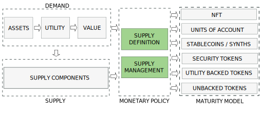
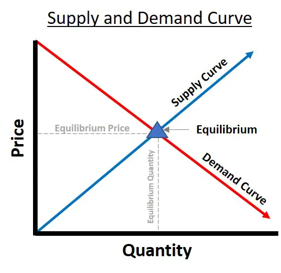
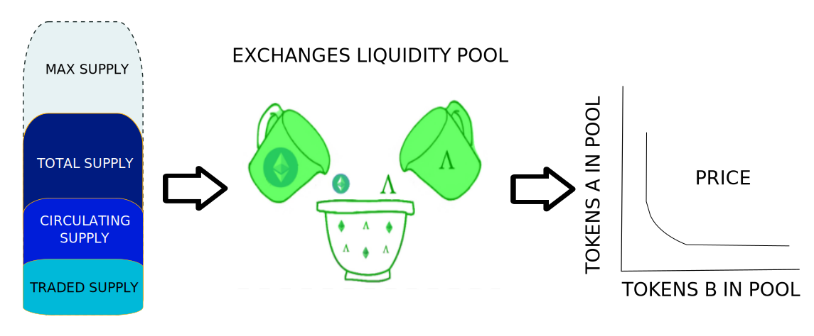
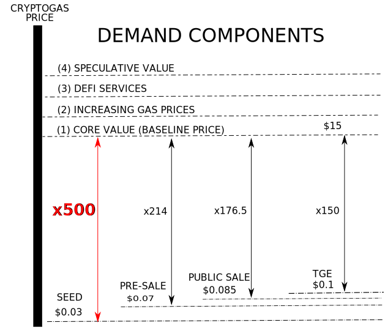
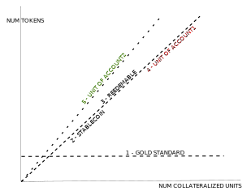

---

import JSONTable from '@site/src/components/ui/JSONTable';
import tokens_utility from "/static/data/tokens_utility.json"

:::danger
`(Under development. Please, come back later. Just published to share the progress)`
:::

## 1. Introduction
---

The nature, behaviour and price of a cryptocurrency is determined by the interaction between a demand and a supply coordinated by a monetary policy. Depending on the policy we will have different types of tokens.

We will discuss the Monetary Policies in this post and leave demand and supply for next posts.

<!-- truncate -->

## 2. Token Price
---

### 2.1 Price Determination

As with any other asset, the price for a token is determined as an equilibrium between demand and supply. Price of Token A expressed in token B is the number of units of token B that investors are willing to pay to acquire a unit of token A.

This evaluation between supply and demand is carried out in the exchanges. Additionally price for a token pair uses to be uniform across the exchanges because arbitrage.

The lower the total traded supply amount across the liquidity pools for a token, the higher the price will get in the exchanges.

### 2.2 Price Components

As in CRYPTOGAS the supply is fixed in the Value Capture Stage, the price will be only determined by demand, as described in CRYPTOGAS Engineering. In order to increase CRYPTOGAS price we must increase the demand of the token. This will move to investor to hold CRYPTOGAS in their portfolios, the traded supply will be reduced and the price will move higher.

The price will have several components.

* 1 - By guaranteeing that the intrinsic value of the underlying asset is captured we can assume that at the medium term, the value of the token will be 15$. Besides the described base scenario, there are additional deflationary reasons that suggest price of underlying asset will get higher from this baseline:.

* 2 - Gas prices are growing because oil scarcity

* 3 - A token shared by millions can easily find additional utilities in the shape of DeFi Services

* 4 - Finally we must maximize speculative value by providing quality of products and services.

## 3. Supply Policies
---

### 3.1 Supply Definition

On determining the token supply we can decide between 6 scenarios:

On the basic Gold Standard scenario (1), the supply is fixed. No value of price is captured and the token is hyperdeflationary. this is the paradise or investors because they will see the token price growing.

If we match the Total Supply to the Number Collateral Units, the total value of the token will be captured, no matter if this value is created by primary utility (3), which makes the token redeemable, or by aggregated utility, which will create a Unit of Account (4). In the case that we want to capture the fiat price of the collateral, we must manipulate the balance of the pair in the liquidity pools, which is the case of stablecoins (2).

Finally, to capture the natural value of the collateral, as a natural Unit of Account (5), we need to match the traded supply to the number of collateral units. The problem for this case is that the token wont be reedemable.

<table class="table w-auto mx-auto fs-6">
	<thead class="thead-dark">
		<tr>
			<th scope="col">#</th>
			<th scope="col">Scenario</th>
			<th scope="col">Supply</th>
			<th scope="col">Pairs</th>
			<th scope="col">Capture</th>
			<th scope="col">Deflationary</th>
			<th scope="col">Redeemable</th>
			<th scope="col">Fiat</th>
		</tr>
	</thead>
	<tbody>
		<tr>
			<th scope="row">1</th>
			<th scope="row">Gold Standard</th>
			<td>Fixed</td>
			<td>Any</td>
			<td>No</td>
			<td>Hyper</td>
			<td>No</td>
			<td>Indep</td>
		</tr>
		<tr>
			<th scope="row">2</th>
			<th scope="row">Stablecoin</th>
			<td rowspan="3">Total Supply = Num Collateral Units</td>
			<td>Any</td>
			<td>Price</td>
			<td>No</td>
			<td>Yes</td>
			<td>Dep</td>
		</tr>
		<tr>
			<th scope="row">3</th>
			<th scope="row">Reedemable</th>
			<td>Any</td>
			<td>Value</td>
			<td>Yes</td>
			<td>Yes</td>
			<td>Indep</td>
		</tr>
		<tr>
			<th scope="row">4</th>
			<th scope="row">Unit of Account 1</th>
			<td>Any</td>
			<td>Agg Value</td>
			<td>Yes</td>
			<td>No</td>
			<td>Indep</td>
		</tr>
		<tr>
			<th scope="row">5</th>
			<th scope="row">Unit of Account 2</th>
			<td>Traded Supply = Num Collateral Units</td>
			<td>Any</td>
			<td>Value</td>
			<td>No</td>
			<td>No</td>
			<td>Indep</td>
		</tr>
	</tbody>
</table>

Depending on the goal of every project, a supply definition strategy must be decided. A combination of strategies is also a valid option.

### 3.2. Supply Management

#### 3.2.1. Burn and Mint Equilibrium

#### 3.2.2. Stability Fees

#### 3.2.3. Reserve

#### 3.2.4. Elastic Supply Tokens (Rebases)

